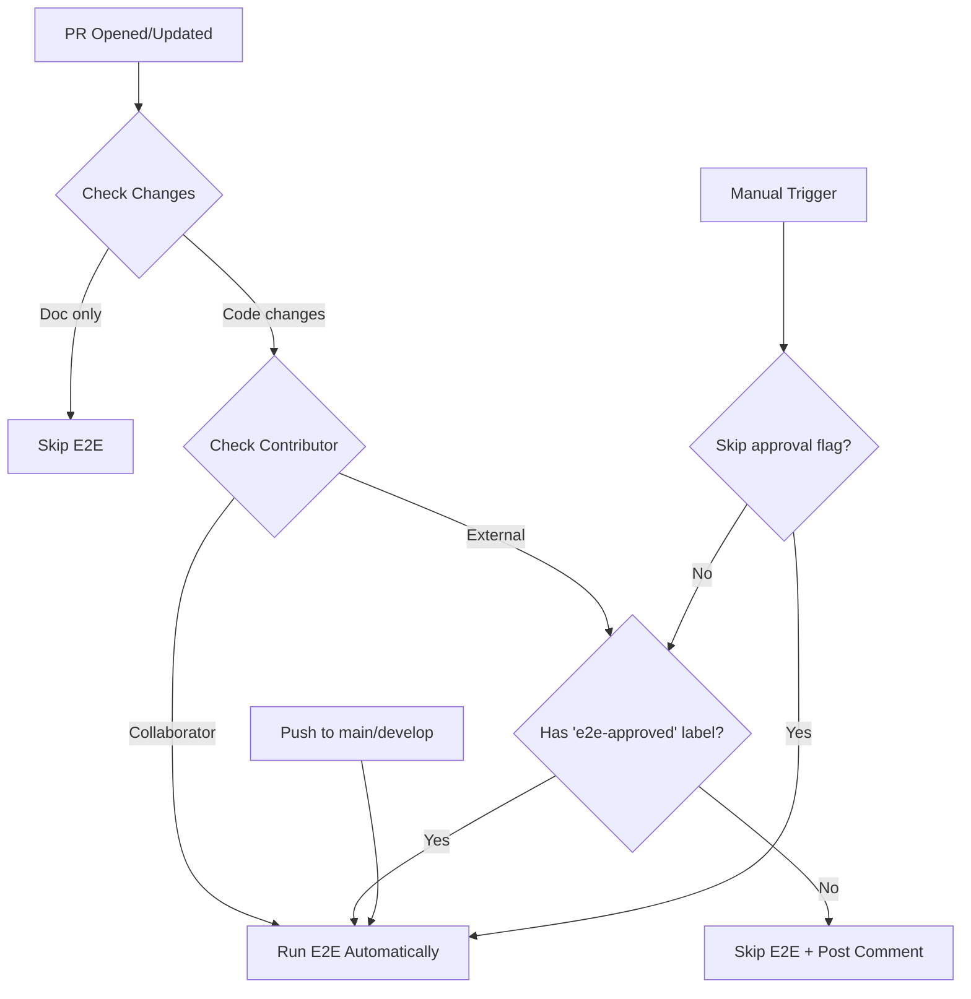

# E2E Tests Approval Guide for Maintainers

## Overview

The project uses a two-tier CI workflow to securely run E2E tests that require Tailscale secrets:

1. **CI Workflow** (`ci.yml`) - Runs automatically on all PRs
   - Branch validation
   - Linting
   - Unit tests
   - Build verification
   - **No secrets required**

2. **E2E Tests Workflow** (`ci-e2e.yml`) - Requires approval for external contributors
   - E2E server provisioning (via Tailscale)
   - Linux E2E tests
   - Windows E2E tests
   - **Requires Tailscale secrets**

## How It Works

### For Trusted Contributors
- Repository collaborators (members with write access)
- Pushes to `main` or `develop` branches

**E2E tests run automatically** - No approval needed.

### For External Contributors
External contributors (non-collaborators) submit PRs without access to secrets.

**E2E tests require manual approval** - Maintainers must review and approve.

## Approval Process for External PRs

### Step 1: Fast Feedback Runs Automatically
When an external contributor opens a PR:
1. ✅ Fast feedback checks run immediately (linting, unit tests, build)
2. ⏸️ E2E tests are **skipped** (no secrets exposed)
3. 🤖 Bot adds a comment explaining approval is needed

### Step 2: Review the Changes
**As a maintainer, you must:**
1. Review the PR code changes thoroughly
2. Check for any malicious code or security concerns
3. Verify the changes don't attempt to exfiltrate secrets
4. Ensure the contribution is legitimate

⚠️ **Security Warning:** Once approved, the E2E workflow will have access to Tailscale secrets. Only approve PRs you trust!

### Step 3: Approve E2E Tests
If the PR is safe to test:

```bash
# Add the approval label via GitHub CLI
gh pr edit <PR_NUMBER> --add-label "e2e-approved"

# Or via GitHub web interface:
# 1. Go to the PR
# 2. Click "Labels" on the right sidebar
# 3. Add "e2e-approved" label
```

### Step 4: E2E Tests Run
Once the label is added:
1. The `ci-e2e.yml` workflow automatically triggers
2. E2E tests run with Tailscale secrets
3. Results appear in the PR checks

## Removing Approval

If you need to revoke approval (e.g., contributor pushes new suspicious code):

```bash
# Remove the approval label
gh pr edit <PR_NUMBER> --remove-label "e2e-approved"
```

E2E tests will be skipped on subsequent pushes until re-approved.

## Manual E2E Test Trigger

Maintainers can manually trigger E2E tests without the label:

1. Go to **Actions** → **E2E Tests** workflow
2. Click **Run workflow**
3. Select the branch
4. Check **Skip approval check** (maintainers only)
5. Click **Run workflow**

## Creating the Label

If the `e2e-approved` label doesn't exist in your repository:

```bash
# Create the label via GitHub CLI
gh label create "e2e-approved" \
  --description "E2E tests approved by maintainer" \
  --color "0E8A16"

# Or via GitHub web interface:
# 1. Go to Issues → Labels
# 2. Click "New label"
# 3. Name: e2e-approved
# 4. Description: E2E tests approved by maintainer
# 5. Color: Green (#0E8A16)
```

## Checking Contributor Status

The workflow automatically checks if the PR author is a repository collaborator using:

```bash
gh api "/repos/OWNER/REPO/collaborators/USERNAME"
```

**Collaborators** = Users with:
- Write access or higher
- Appear in repository Settings → Collaborators

## Workflow Decision Logic



## Best Practices

### ✅ DO:
- Review **every line** of code before approving
- Check for attempts to access or log secrets
- Verify the contributor's GitHub profile and history
- Remove approval if new commits are pushed
- Ask questions if anything seems suspicious

### ❌ DON'T:
- Auto-approve PRs without review
- Approve PRs that modify workflow files without careful scrutiny
- Leave the `e2e-approved` label on PRs indefinitely
- Approve PRs from brand new GitHub accounts without extra caution

## Troubleshooting

### E2E tests not running for trusted contributors
- Verify they are listed as a collaborator in repository settings
- Check if their permissions were recently changed
- Manually trigger with "Skip approval check"

### E2E tests still skipped after adding label
- Ensure the label is exactly `e2e-approved` (case-sensitive)
- Check workflow run logs for decision logic output
- Verify the PR has E2E-relevant code changes

### Bot comment not appearing
- Check if `pull-requests: read` permission is granted
- Verify GitHub CLI (`gh`) is working in the workflow
- Comment may be suppressed if it already exists

## Security Considerations

This approval process prevents:
- ✅ Secret exposure in external PR logs
- ✅ Malicious code execution with secrets
- ✅ Unauthorized Tailscale network access

However, maintainers must still:
- ⚠️ Manually review all code changes
- ⚠️ Be vigilant for social engineering
- ⚠️ Rotate secrets if compromise is suspected

## Questions?

If you're unsure whether to approve a PR:
- Ask other maintainers for a second opinion
- Request the contributor explain suspicious code
- Wait for more context before approving
- When in doubt, **don't approve**
