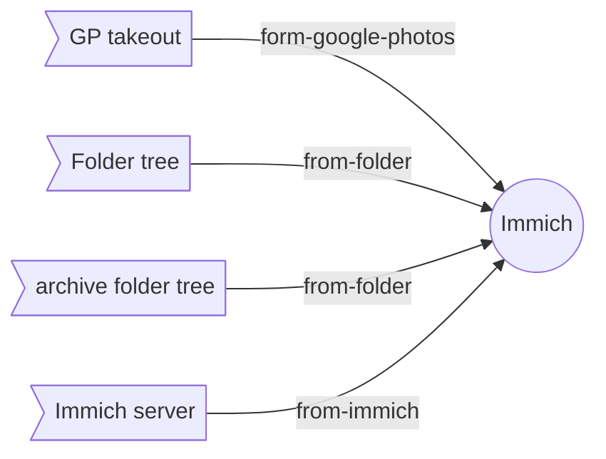
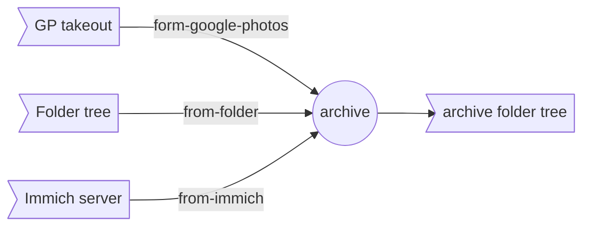

# Immich-Go: Upload Your Photos to Your Immich Server

**Immich-Go** is an open-source tool designed to streamline uploading large photo collections to your self-hosted Immich server.

> ⚠️ This is an early version, not yet extensively tested<br>
> ⚠️ Keep a backup copy of your files for safety<br>


## Support the project `Immich-go`

- [Github Sponsor](https://github.com/sponsors/simulot)
- [PayPal Donation](https://www.paypal.com/donate/?hosted_button_id=VGU2SQE88T2T4)


## What Makes Immich-Go Special?

### Simple Installation: 
  * Immich-Go doesn't require NodeJS or Docker for installation. This makes it easy to get started, even for those less familiar with technical environments. 
  * Immich-go can run on either your workstation or a NAS.

### Handles Large Photo Collections:
  * **Upload Large Google Photos Takeouts:**  Immich-Go excels at handling massive archives downloaded from Google Photos using Google Takeout. It efficiently processes these archives while preserving valuable metadata like GPS location, capture date, and album information. Read the [best practices](#google-photos-best-practices) below for more information.
  * **Upload collections:** You can upload photos directly from your computer folders, folders trees and compressed ZIP archives.
  * **Is Duplicate-aware:** Immich-Go identifies and discards duplicate photos, keeping only the highest-quality version on the server.
  * **Archive your Immich server:**  Write the content of your Immich server to a folder tree, ready to be archived or migrated to another server.

### Has Many Options:
* Stack burst photos
* Manage coupled RAW and JPEG files, HEIC and JPEG files.
* Use tags
* ... and much more

### Run on Any platform:
  * Immich-Go is available for Windows, MacOS, Linux, and FreeBSD. It can run on any platform where the Go language Go ported.

## Requirements

* **Immich Server:** You need a running Immich server to use Immich-Go.
  * Prepare the server's URL (http://your-ip:2283 or https://your-domain.tld)
  * Collect an API key for each Immich user.
* **Basic knowledge of command line:** Immich-Go is a command-line tool, so you should be comfortable using a terminal.
* Optional: install `exiftool` to get the date of capture from the photo's metadata.  

## Upgrading from Original `immich-go`

This version is a complete rewrite of the original `immich-go` project. It is designed to be more efficient, more reliable, and easier to use. It is also more flexible, with more options and features.
As a consequence, the command line options have changed. Please refer to the documentation for the new options.

The visible changes are:
- **Adoption of the linux convention** for the command line options: use 2 dashes for long options.
- Complete restructuring of the CLI logic:
  - The `upload` command accepts 3 sub-commands: `from-google-photos`, `from-folder`, `from-immich`. This removes all ambiguity from the options.
  - The new `archive` command takes advantage of this sub-command logic. It is possible to archive from a Google Photos takeout, a folder tree or an Immich server.

The upgrade process consists of installing the new version over the previous one. 
You can check the version of the installed `immich-go` by running `immich-go --version`.


## Installation

### Prerequisites

- For pre-built binaries: No prerequisites needed
- For building from source: 
  - Go 1.23 or higher
  - Git
- Optional dependencies:
  - ExifTool: Enhanced metadata extraction capabilities
    - On Linux: `sudo apt-get install exiftool`
    - On MacOS: `brew install exiftool`
    - On Windows: Download from [ExifTool website](https://exiftool.org/)

### Pre-built Binaries

The easiest way to install Immich-Go is to download the pre-built binary for your system from the [GitHub releases page](https://github.com/simulot/immich-go/releases).

#### **Supported Platforms:**
- **Operating Systems**
  - MacOS
  - Windows
  - Linux
  - FreeBSD

- **Architectures**
  - AMD64 (x86_64)
  - ARM

#### Installation Steps

1. Visit the [GitHub latest release page](https://github.com/simulot/immich-go/releases/latest)
2. Download the archive for your operating system and architecture:
   - Windows: `immich-go_Windows_amd64.zip`
   - MacOS: `immich-go_Darwin_amd64.tar.gz`
   - Linux: `immich-go_Linux_amd64.tar.gz`
   - FreeBSD: `immich-go_Freebsd_amd64.tar.gz`
   - and much more...
   
3. Extract the archive:
   ```bash
   # For Linux/MacOS/FreeBSD
   tar -xzf immich-go_*_amd64.tar.gz

   # For Windows
   # Use your preferred zip tool to extract the archive
   ```

4. (Optional) Move the binary to a directory in your PATH:
   ```bash
   # Linux/MacOS/FreeBSD
   sudo mv immich-go /usr/local/bin/

   # Windows
   # Move immich-go.exe to a directory in your PATH
   ```

### Building from Source
If pre-built binaries are not available, you can build Immich-Go from source.

#### Prerequisites
- Go 1.23 or higher
- Git

#### Build Steps
```bash
# Clone the repository
git clone https://github.com/simulot/immich-go.git

# Change to the project directory
cd immich-go

# Build the binary
go build

# (Optional) Install to GOPATH/bin
go install
```
### Installation with Nix

`immich-go` is packaged with [nix](https://nixos.org/) and distributed via [nixpkgs](https://search.nixos.org/packages?channel=unstable&type=packages&query=immich-go).
You can try `immich-go` without installing it with:

```bash
nix-shell -I "nixpkgs=https://github.com/NixOS/nixpkgs/archive/nixos-unstable-small.tar.gz" -p immich-go
# Or with flakes enabled
nix run "github:nixos/nixpkgs?ref=nixos-unstable-small#immich-go" -- -help
```

Or you can add `immich-go` to your `configuration.nix` in the `environment.systemPackages` section.


## Verifying the Installation

After installation, verify that immich-go is working correctly:

```bash
immich-go --version
```

This should display the version number of immich-go.


# Running Immich-Go

Each command has its own set of options and sub-commands. The following sections detail the available commands and their options.

The general syntax for running immich-go is:

```bash
immich-go command sub-command options path/to/files
```

The list of options can be obtained by running `immich-go -help` or `immich-go command sub-command -help`.

All commands accept the following options:

| **Parameter**  | **Description**                                                     |
| -------------- | ------------------------------------------------------------------- |
| -h, --help     | help for immich-go                                                  |
| -l, --log-file | Write log messages into the file                                    |
| --log-level    | Log level (DEBUG\|INFO\|WARN\|ERROR), default INFO (default "INFO") |
| --log-type     | Log format (TEXT\|JSON) (default "TEXT")                            |
| -v, --version  | version for immich-go                                               |

# The **upload** command:
The **upload** command loads photos and videos from the given source determined by a sub-command to the Immich server. 
The general syntax is:

```bash
immich-go upload from-sub-command options path/to/files
```


## The **upload** sub-commands:




Beside the classic usages, you can use the **upload** for those edge cases:
- Transfer photos from a live server to another one, using the **from-immich** sub-command.
- Transfer photos from an immich account to another one, using the **from-immich** sub-command.


## Shared options by all **upload** sub-command:

| **Parameter**        | **Default value** | **Description**                                                                            |
| -------------------- | :---------------: | ------------------------------------------------------------------------------------------ |
| -s, --server         |                   | Immich server address (example http://your-ip:2283 or https://your-domain) (**MANDATORY**) |
| -k, --api-key        |                   | API Key (**MANDATORY**)                                                                    |
| --api-trace          |      `FALSE`      | Enable trace of api calls                                                                  |
| --client-timeout     |      `5m0s`       | Set server calls timeout                                                                   |
| --device-uuid string |   `$LOCALHOST`    | Set a device UUID                                                                          |
| --dry-run            |                   | Simulate all server actions                                                                |
| --skip-verify-ssl    |      `FALSE`      | Skip SSL verification                                                                      |
| --time-zone          |                   | Override the system time zone (example: Europe/Paris)                                      |

Details on the available options for each sub-command are provided below.

# The **archive** command:

The **archive** command writes the content taken from the source given by the sub-command to a folder tree. 
All photos and videos are sorted by date of capture, following this schema: `Folder/YYYY/YYYY-MM/photo.jpg`.


Here is an example of how your folder structure might look:

```
Folder/
├── 2022/
│   ├── 2022-01/
│   │   ├── photo01.jpg
│   │   └── photo01.jpg.JSON
│   ├── 2022-02/
│   │   ├── photo02.jpg
│   │   └── photo02.jpg.JSON
│   └── ...
├── 2023/
│   ├── 2023-03/
│   │   ├── photo03.jpg
│   │   └── photo03.jpg.JSON
│   ├── 2023-04/
│   │   ├── photo04.jpg
│   │   └── photo04.jpg.JSON
│   └── ...
├── 2024/
│   ├── 2024-05/
│   │   ├── photo05.jpg
│   │   └── photo05.jpg.JSON
│   ├── 2024-06/
│   │   ├── photo06.jpg
│   │   └── photo06.jpg.JSON
│   └── ...
```

This structure ensures that photos are neatly organized by year and month within the specified folder, making it easy to locate and manage them.
This folder tree is ready to be archived or migrated to another server.

The general syntax is:

```bash
immich-go archive from-sub-command --write-to-folder=folder options 
```


### **archive** sub-commands:



Beside the classic usages, we can use the **archive** for those edge cases:
- Process a google photos takeout to remove duplicates, using the **from-google-photos** sub-command.
- Process a folder tree to sort photos in folders by date, using the **from-folder** sub-command.

## Options for **from-folder** sub command:

The **from-folder** sub-command processes a folder tree to upload photos to the Immich server.

| **Parameter**           | **Default value**                     | **Description**                                                                                                                                                                                                                                                                                      |
| ----------------------- | ------------------------------------- | ---------------------------------------------------------------------------------------------------------------------------------------------------------------------------------------------------------------------------------------------------------------------------------------------------- |
| --album-path-joiner     | `" / "`                               | Specify a string to use when joining multiple folder names to create an album name (e.g. ' ',' - ')                                                                                                                                                                                                  |
| --ban-file              | [See banned files](#banned-file-list) | Exclude a file based on a pattern (case-insensitive). Can be specified multiple times.                                                                                                                                                                                                               |
| --capture-date-method   | `NONE`                                | Specify the method to determine the capture date when not provided in a sidecar file. Options: NONE (do not attempt to determine), FILENAME (extract from filename), EXIF (extract from EXIF metadata), FILENAME-EXIF (try filename first, then EXIF), EXIF-FILENAME (try EXIF first, then filename) |
| --date-range            |                                       | Only import photos taken within the specified date range. Require the use of `exiftool`. [See date range possibilities](#date-range)                                                                                                                                                                 |
| --exclude-extensions    |                                       | Comma-separated list of extension to exclude. (e.g. .gif,.PM)                                                                                                                                                                                                                                        |
| --exiftool-enabled      | `FALSE`                               | Enable the use of the external 'exiftool' program (if installed and available in the system path) to extract EXIF metadata                                                                                                                                                                           |
| --exiftool-path         |                                       | Path to the ExifTool executable (default: search in system's PATH)                                                                                                                                                                                                                                   |
| --exiftool-timezone     | `LOCAL`                               | Timezone to use when parsing exif timestamps without timezone Options: LOCAL (use the system's local timezone), UTC (use UTC timezone), or a valid timezone name (e.g. America/New_York)                                                                                                             |
| --folder-as-album       | `NONE`                                | Import all files in albums defined by the folder structure. Can be set to 'FOLDER' to use the folder name as the album name, or 'PATH' to use the full path as the album name                                                                                                                        |
| --folder-as-tags        | `FALSE`                               | Use the folder structure as tags, (ex: the file  holiday/summer 2024/file.jpg will have the tag holiday/summer 2024)                                                                                                                                                                                 |
| --ignore-sidecar-files  | `FALSE`                               | Don't upload sidecar with the photo.                                                                                                                                                                                                                                                                 |
| --include-extensions    | all                                   | Comma-separated list of extension to include. (e.g. .jpg,.heic)                                                                                                                                                                                                                                      |
| --into-album            |                                       | Specify an album to import all files into                                                                                                                                                                                                                                                            |
| --manage-burst          |                                       | Manage burst photos. Possible values: Stack, StackKeepRaw  tackKeepJPEG                                                                                                                                                                                                                              |
| --manage-epson-fastfoto | `FALSE`                               | Manage Epson FastFoto file                                                                                                                                                                                                                                                                           |
| --manage-heic-jpeg      |                                       | Manage coupled HEIC and JPEG files. Possible values: KeepHeic, KeepJPG, StackCoverHeic, StackCoverJPG                                                                                                                                                                                                |
| --manage-raw-jpeg       |                                       | Manage coupled RAW and JPEG files. Possible values: KeepRaw, KeepJPG, StackCoverRaw, StackCoverJPG                                                                                                                                                                                                   |
| --recursive             | `TRUE`                                | Explore the folder and all its sub-folders                                                                                                                                                                                                                                                           |
| --session-tag           |                                       | Tag uploaded photos with a tag "{immich-go}/YYYY-MM-DD HH-MM-SS"                                                                                                                                                                                                                                     |
| --tag                   |                                       | Add tags to the imported assets. Can be specified multiple times. Hierarchy is supported using a / separator (e.g. 'tag1/subtag1')                                                                                                                                                                   |


### Options for **from-google-photos**:

The **from-google-photos** sub-command processes a Google Photos takeout archive to upload photos to the Immich server.

| **Parameter**                | **Default value**                     | **Description**                                                                                                                                                                                                                                                                                      |
| ---------------------------- | ------------------------------------- | ---------------------------------------------------------------------------------------------------------------------------------------------------------------------------------------------------------------------------------------------------------------------------------------------------- |
| --ban-file FileList          | [See banned files](#banned-file-list) | Exclude a file based on a pattern (case-insensitive). Can be specified multiple times.                                                                                                                                                                                                               |
| --capture-date-method        | `NONE`                                | Specify the method to determine the capture date when not provided in a sidecar file. Options: NONE (do not attempt to determine), FILENAME (extract from filename), EXIF (extract from EXIF metadata), FILENAME-EXIF (try filename first, then EXIF), EXIF-FILENAME (try EXIF first, then filename) |
| --date-range                 |                                       | Only import photos taken within the specified date range [See date range possibilities](#date-range)                                                                                                                                                                                                 |
| --exclude-extensions         |                                       | Comma-separated list of extension to exclude. (e.g. .gif,.PM)                                                                                                                                                                                                                                        |
| --exiftool-enabled           |                                       | Enable the use of the external 'exiftool' program (if installed and available in the system path) to extract EXIF metadata                                                                                                                                                                           |
| --exiftool-path string       |                                       | Path to the ExifTool executable (default: search in system's PATH)                                                                                                                                                                                                                                   |
| --exiftool-timezone timezone |                                       | Timezone to use when parsing exif timestamps without timezone Options: LOCAL (use the system's local timezone), UTC (use UTC timezone), or a valid timezone name (e.g. America/New_York) (default Local)                                                                                             |
| --from-album-name string     |                                       | Only import photos from the specified Google Photos album                                                                                                                                                                                                                                            |
| -a, --include-archived       | `TRUE`                                | Import archived Google Photos                                                                                                                                                                                                                                                                        |
| --include-extensions         | `all`                                 | Comma-separated list of extension to include. (e.g. .jpg,.heic)                                                                                                                                                                                                                                      |
| -p, --include-partner        | `TRUE`                                | Import photos from your partner's Google Photos account                                                                                                                                                                                                                                              |
| -t, --include-trashed        | `FALSE`                               | Import photos that are marked as trashed in Google Photos                                                                                                                                                                                                                                            |
| -u, --include-unmatched      | `FALSE`                               | Import photos that do not have a matching JSON file in the takeout                                                                                                                                                                                                                                   |
| --include-untitled-albums    | `FALSE`                               | Include photos from albums without a title in the import process                                                                                                                                                                                                                                     |
| --manage-burst               |                                       | Manage burst photos. Possible values: Stack, StackKeepRaw, StackKeepJPEG. [See option's details](#burst-detection-and-management)                                                                                                                                                                    |
| --manage-epson-fastfoto      | `FALSE`                               | Manage Epson FastFoto file (default: false)                                                                                                                                                                                                                                                          |
| --manage-heic-jpeg           |                                       | Manage coupled HEIC and JPEG files. Possible values: KeepHeic, KeepJPG, StackCoverHeic, StackCoverJPG   [See option's details](#management-of-coupled-heic-and-jpeg-files)                                                                                                                           |
| --manage-raw-jpeg            |                                       | Manage coupled RAW and JPEG files. Possible values: KeepRaw, KeepJPG, StackCoverRaw, StackCoverJPG. [See options's details](#management-of-coupled-raw-and-jpeg-files)                                                                                                                               |
| --partner-shared-album       |                                       | Add partner's photo to the specified album name                                                                                                                                                                                                                                                      |
| --session-tag                | `FALSE`                               | Tag uploaded photos with a tag "{immich-go}/YYYY-MM-DD HH-MM-SS"                                                                                                                                                                                                                                     |
| --sync-albums                | `TRUE`                                | Automatically create albums in Immich that match the albums in your Google Photos takeout (default true)                                                                                                                                                                                             |
| --tag strings                |                                       | Add tags to the imported assets. Can be specified multiple times. Hierarchy is supported using a / separator (e.g. 'tag1/subtag1')                                                                                                                                                                   |
| --takeout-tag                | `FALSE`                               | Tag uploaded photos with a tag "{takeout}/takeout-YYYYMMDDTHHMMSSZ" (default true)                                                                                                                                                                                                                   |


### Options for **from-immich**:

The sub-command **from-immich** processes an Immich server to upload photos to another Immich server.

| **Parameter**                  | **Default value** | **Description**                                                                      |
| ------------------------------ | ----------------- | ------------------------------------------------------------------------------------ |
| --from-server                  |                   | Immich server address (example http://your-ip:2283 or https://your-domain)           |
| --from-api-key string          |                   | API Key                                                                              |
| --from-album                   |                   | Get assets only from those albums, can be used multiple times                        |
| --from-api-trace               | `FALSE`           | Enable trace of api calls                                                            |
| --from-client-timeout duration | `5m0s`            | Set server calls timeout (default 5m0s)                                              |
| --from-date-range              |                   | Get assets only within this date range.  [See date range possibilities](#date-range) |
| --from-skip-verify-ssl         | `FALSE`           | Skip SSL verification                                                                |


# Additional information and best practices

## Google Photos Best Practices:

* **Taking Out Your Photos:**
  * Choose the ZIP format when creating your takeout for easier import.
  * Select the largest file size available (50GB) to minimize the number of archive parts.
  * Download all parts to your computer.

* **Importing Your Photos:**
  * If your takeout is in ZIP format, you can import it directly without needing to unzip the files first.
  * It's important to import all the parts of the takeout together, since some data might be spread across multiple files. 
    <br>Use `/path/to/your/files/takeout-*.zip` as file name.
  * For **.tgz** files (compressed tar archives), you'll need to decompress all the files into a single folder before importing. 
  * You can remove any unwanted files or folders from your takeout before importing. 
  * Restarting an interrupted import won't cause any problems and it will resume the work where it was left.

* **Lot of files are not imported**: What are the options?
  * Verify if all takeout parts have been included in the processing. Have you used the `takeout-*.zip` file name pattern?
  * Sometime, the takeout results is crippled. Request another takeout, either for an entire year or in smaller increments.
  * Force the import of files despite the missing JSON. Use the option `-upload-when-missing-JSON`

For insights into the reasoning behind this alternative to `immich-cli`, please read the motivation [here](docs/motivation.md).


## **XMP** files process

**XMP** files found in source folder are passed to Immich server without any modification. Immich uses them to collect photo's date of capture and GPS location.

## Google photos **JSON** files process

Google photos **JSON** files found in source folders are opened to get the album belonging, the date of capture and the GPS location, the favorite status, the partner status, the archive status and the trashed status. This information is used to trigger Immich features.

## Folder archive **JSON** files process

Those files are generated by the **archive** command. Their are used to restore immich features like album, date of capture, GPS location, rating, tags and archive status.

```json
{
  "fileName": "example.jpg",
  "latitude": 37.7749,
  "longitude": -122.4194,
  "dateTaken": "2023-10-01T12:34:56Z",
  "description": "A beautiful view of the Golden Gate Bridge.",
  "albums": [
    {
      "title": "San Francisco Trip",
      "description": "Photos from my trip to San Francisco",
    }
  ],
  "tags": [
    {
      "value": "USA/California/San Francisco"
    },
  
  ],
  "rating": 5,
  "trashed": false,
  "archived": false,
  "favorited": true,
  "fromPartner": false
}
```

## Session tags
Immich-go can tag all imported photos with a session tag. The tag is formatted as `{immich-go}/YYYY-MM-DD HH-MM-SS`. This tag can be used to identify all photos imported during a session. This it easy to remove them if needed.

## Takeout tag
Immich-go can tag all imported photos with a takeout tag. The tag is formatted as `{takeout}/takeout-YYYYMMDDTHHMMSSZ`. This tag can be used to identify all photos imported from a Google Photos takeout. This it easy to remove them if needed.

## Banned file list
The following files are excluded automatically:
- `@eaDir/`
- `@__thumb/`
- `SYNOFILE_THUMB_*.*`
- `Lightroom Catalog/`
- `thumbnails/`
- `.DS_Store/`
- `._*.*`

## Date range

The `--date-range` option allows you to process photos taken within a specific date range. The following date range formats are supported:

| **Parameter**                       | **Description**                                |
| ----------------------------------- | ---------------------------------------------- |
| `-date-range=YYYY-MM-DD`            | import photos taken on a particular day.       |
| `-date-range=YYYY-MM`               | select photos taken during a particular month. |
| `-date-range=YYYY`                  | select photos taken during a particular year.  |
| `-date-range=YYYY-MM-DD,YYYY-MM-DD` | select photos taken between two dates.         |


## Burst detection and management

The system detects burst photos in following cases:

| Case                | Description                                                                                                                                                           |
| ------------------- | --------------------------------------------------------------------------------------------------------------------------------------------------------------------- |
| Series of photos    | When the time difference between 2 photo is less than 500 ms                                                                                                          |
| Huawei smartphones  | Based on file names: <br>- IMG_20231014_183246_BURST001_COVER.jpg<br>- IMG_20231014_183246_BURST002.jpg<br>- IMG_20231014_183246_BURST003.jpg                          |
| Nexus smartphones   | Based on files names:<br>- 00001IMG_00001_BURST20171111030039.jpg<br>-...<br>-00014IMG_00014_BURST20171111030039.jpg<br>-00015IMG_00015_BURST20171111030039_COVER.jpg |
| Pixel smartphones   | Based on files names:<br>- PXL_20230330_184138390.MOTION-01.COVER.jpg<br>- PXL_20230330_184138390.MOTION-02.ORIGINAL.jpg                                              |
| Samsung smartphones | Based on files names:<br>- 20231207_101605_001.jpg<br>- 20231207_101605_002.jpg<br>- 20231207_101605_xxx.jpg                                                          |
| Sony Xperia         | Based on files names:<br>- DSC_0001_BURST20230709220904977.JPG<br>- ...<br>- DSC_0035_BURST20230709220904977_COVER.JPG                                                |

The option  `--manage-burst` instructs Immich-go how to manage burst photos. The following options are available:

| Option          | Description                                                                                                                                  |
| --------------- | -------------------------------------------------------------------------------------------------------------------------------------------- |
| `stack`         | Stack all burst photos together. When the cover photo can't be identified with the file name, the first photo of the burst is used as cover. |
| `stackKeepRaw`  | Stack all burst photos together. Keep only the RAW photos.                                                                                   |
| `stackKeepJPEG` | Stack all burst photos together. Keep only the JPEG photos.                                                                                  |


## Management of coupled HEIC and JPEG files

The option `--manage-heic-jpeg` instructs Immich-go how to manage HEIC and JPEG files. The following options are available:

| Option           | Description                                                         |
| ---------------- | ------------------------------------------------------------------- |
| `KeepHeic`       | Keep only the HEIC file.                                            |
| `KeepJPG`        | Keep only the JPEG file.                                            |
| `StackCoverHeic` | Stack the HEIC and JPEG files together. The HEIC file is the cover. |
| `StackCoverJPG`  | Stack the HEIC and JPEG files together. The JPEG file is the cover. |

## Management of coupled RAW and JPEG files

The option `--manage-raw-jpeg` instructs Immich-go how to manage RAW and JPEG files. The following options are available:

| Option          | Description                                                        |
| --------------- | ------------------------------------------------------------------ |
| `KeepRaw`       | Keep only the RAW file.                                            |
| `KeepJPG`       | Keep only the JPEG file.                                           |
| `StackCoverRaw` | Stack the RAW and JPEG files together. The RAW file is the cover.  |
| `StackCoverJPG` | Stack the RAW and JPEG files together. The JPEG file is the cover. |


# Examples

## Example: Importing a Google Takeout with Stacking JPEG and RAW

To import a Google Photos takeout and stack JPEG and RAW files together, with the RAW file as the cover, use the following command:

```bash
immich-go upload from-google-photos --server=http://your-ip:2283 --api-key=your-api-key --manage-raw-jpeg=StackCoverRaw /path/to/your/takeout-*.zip
```

## Example: Uploading Photos from a Local Folder

To upload photos from a local folder to your Immich server, use the following command:

```bash
immich-go upload from-folder --server=http://your-ip:2283 --api-key=your-api-key /path/to/your/photos
```

## Example: Archiving Photos from Immich Server

To archive photos from your Immich server to a local folder, use the following command:

```bash
immich-go archive from-immich --server=http://your-ip:2283 --api-key=your-api-key --write-to-folder=/path/to/archive
```

## Example: Transferring Photos Between Immich Servers

To transfer photos from one Immich server to another, use the following command:

```bash
immich-go upload from-immich --from-server=http://source-ip:2283 --from-api-key=source-api-key --server=http://destination-ip:2283 --api-key=destination-api-key
```

## Example: Importing Photos with Specific Date Range

To import photos taken within a specific date range from a local folder, use the following command:

```bash
immich-go upload from-folder --server=http://your-ip:2283 --api-key=your-api-key --exiftool-enabled --date-range=2022-01-01,2022-12-31 /path/to/your/photos
```


# Acknowledgments

Kudos to the Immich team for their stunning project! 🤩

This program use following 3rd party libraries:
- [https://github.com/rivo/tview](https://github.com/rivo/tview) the terminal user interface
- [github.com/rwcarlsen/goexif](github.com/rwcarlsen/goexif) to get date of capture from JPEG files
-	[github.com/thlib/go-timezone-local](github.com/thlib/go-timezone-local) for its windows timezone management

A big thank you to the project contributors:
- [rodneyosodo](https://github.com/rodneyosodo) gitub CI, go linter, and advice 
- [sigmahour](https://github.com/sigmahour) SSL management
- [mrwulf](https://github.com/mrwulf) Partner sharing album
- [erkexzcx](https://github.com/erkexzcx) Date determination based on file path and file name
- [benjamonnguyen](https://github.com/benjamonnguyen) Tag API calls

